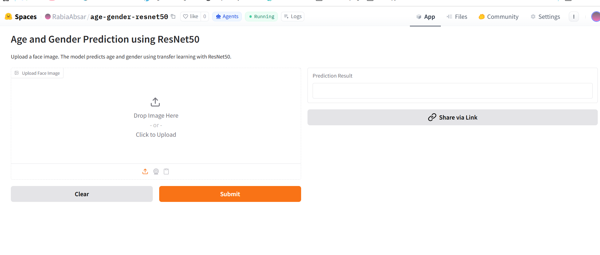
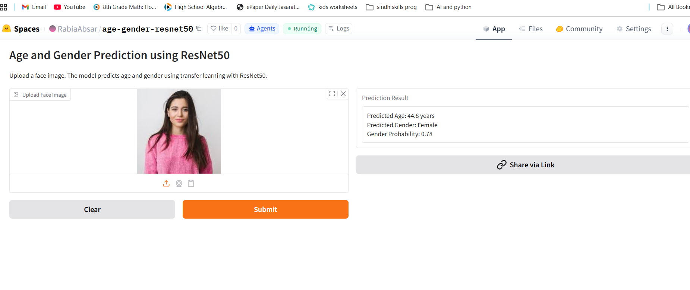

# 👤 Age & Gender Prediction using ResNet50

## Overview

This project is a **Deep Learning** application that predicts a person's **age** and **gender** from a facial image using **transfer learning with ResNet50**. The application provides an interactive interface where users can upload a facial image and receive estimated age and gender predictions.

The project was developed as part of my **Postgraduate Diploma in Generative AI** to gain hands-on experience with transfer learning, computer vision, deep learning, and AI model deployment.

---

## Features

- 👤 Upload facial images
- 📅 Predict estimated age
- 🚻 Predict gender
- 🧠 Deep learning model based on ResNet50
- 🖥 Interactive Gradio interface
- 🌐 Deployed on Hugging Face Spaces

---

## Technologies Used

- Python
- TensorFlow
- Keras
- ResNet50
- Gradio
- Hugging Face Spaces
- Transfer Learning
- Computer Vision
- Deep Learning

---

## Project Workflow

```text
Input Face Image
        │
        ▼
Image Preprocessing
        │
        ▼
ResNet50 Feature Extraction
        │
        ▼
Age Prediction
Gender Prediction
        │
        ▼
Prediction Results
```

---

## 📸 Screenshots

### 🏠 Application Home Page

The application allows users to upload a facial image and receive predicted age and gender estimates.



---

### 👤 Prediction Result

Example showing the predicted age and gender generated by the ResNet50 deep learning model.



---

## Skills Demonstrated

- Deep Learning
- Transfer Learning
- Computer Vision
- TensorFlow
- Keras
- Image Preprocessing
- AI Model Deployment
- Gradio Interface Development

---

## Current Limitations

- Gender prediction generally performs better than age estimation.
- Age prediction accuracy may vary depending on image quality, lighting conditions, facial expressions, and dataset characteristics.
- The application was developed primarily for educational purposes as part of my postgraduate coursework.

---

## Future Improvements

- Improve age prediction accuracy
- Train on a larger and more diverse dataset
- Apply advanced data augmentation techniques
- Hyperparameter tuning
- Support real-time webcam prediction
- Optimize model performance

---

## Live Demo

🚀 Hugging Face Space

https://huggingface.co/spaces/RabiaAbsar/age-gender-predictor

---

## Project Structure

```text
Age-Gender-Prediction-ResNet50/
│
├── app.py
├── requirements.txt
├── README.md
├── images
│     ├── age_gender_homepage.png
│     └── age_gender_predictor_sc.png
├── LICENSE
└── .gitignore
```

> **Note:** The trained `.keras` model is not included in this repository because of GitHub's file size limitations. The deployed application on Hugging Face Spaces uses the trained model for inference.
```

## Author

**Rabia Absar**

Aspiring AI Engineer | Python Developer | Generative AI Enthusiast

### Connect With Me

💼 LinkedIn:
https://www.linkedin.com/in/rabia-absar-9b150a288

🤗 Hugging Face:
https://huggingface.co/spaces/RabiaAbsar/age-gender-resnet50

🐙 GitHub:
https://github.com/rabiaabsar736
